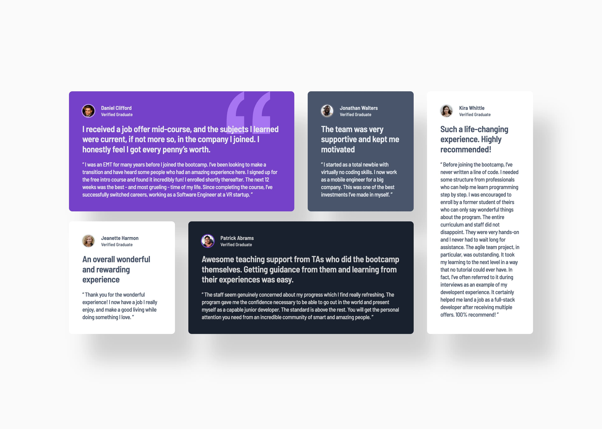

# Frontend Mentor - Testimonials grid section solution

This is a solution to the [Testimonials grid section challenge on Frontend Mentor](https://www.frontendmentor.io/challenges/testimonials-grid-section-Nnw6J7Un7). Frontend Mentor challenges help you improve your coding skills by building realistic projects.

## Table of contents

- [Overview](#overview)
  - [The challenge](#the-challenge)
  - [Screenshot](#screenshot)
  - [Links](#links)
- [My process](#my-process)
  - [Built with](#built-with)
  - [What I learned](#what-i-learned)
  - [Continued development](#continued-development)
  - [Useful resources](#useful-resources)
- [Author](#author)

## Overview

### The challenge

Users should be able to:

- View the optimal layout for the site depending on their device's screen size

### Screenshot

### Links

- Solution URL: [GihHub repo](https://github.com/bulhakovolexii/testimonials-grid-section/)
- Live Site URL: [GitHub pages](https://bulhakovolexii.github.io/testimonials-grid-section/)

## My process

### Built with

- Semantic HTML5 markup
- CSS Grid
- Mobile-first workflow
- [Normalize.css](https://necolas.github.io/normalize.css/)
- [Sass](https://sass-lang.com/)

### What I learned

While working on this project, I managed to refresh my knowledge of CSS Grid. I even tried to avoid using Flex layout, although in this case, I think Flex might have been more appropriate.

I had issues with some cards being overlapped by the shadows of cards that are higher in the document flow. I was able to resolve this by manipulating the order property.

I worked without a Figma layout, and the biggest challenge for me was tuning the box shadows to match the design as closely as possible.

### Continued development

I underestimated how difficult it is to maintain pixel-perfect design alignment without a Figma mockup — by the end, I honestly felt a bit burnt out, and it’s clear that fatigue affected my code quality. I’ll definitely need to revisit and refactor this project later

### Useful resources

- [Sass installation](https://sass-lang.com/install/) - Here you can find instructions on installing the preprocessor and setting up a project for development.

## Author

- GitHub - [@bulhakovolexii](https://github.com/bulhakovolexii)
- Frontend Mentor - [@bulhakovolexii](https://www.frontendmentor.io/profile/bulhakovolexii)
- LinkedIn - [@bulhakovolexii](https://www.linkedin.com/in/bulhakovolexii/)
